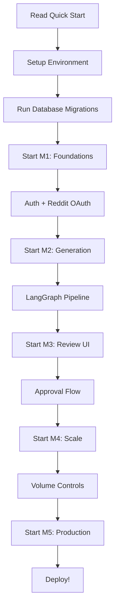

# Quick Start Guide

**⚡ START HERE - Read this first before anything else**

This is your fast-track guide to understanding and building the Mentions Reddit Reply Assistant.

---

## What Are We Building?

An **AI-powered Reddit marketing assistant** that:
1. Finds relevant Reddit conversations for your company
2. Drafts helpful, grounded replies (no links!)
3. Shows drafts for human approval
4. Posts to Reddit safely with verification
5. Learns from feedback over time

---

## 30-Second Overview

```
Keywords → Find Subreddits → Filter with AI → Find Threads → Draft Reply → Human Approval → Post → Verify
```

**Critical Rule**: Every post requires human approval. No autonomous posting.

---

## Your Next 5 Steps

### Step 1: Understand the Architecture (5 min)
Read **[01-TECH-STACK.md](./01-TECH-STACK.md)** to understand:
- Frontend: Next.js 14 + Tailwind
- Backend: FastAPI + LangGraph
- Database: Supabase Postgres
- Infrastructure: GCP Cloud Run

### Step 2: Set Up Your Environment (30 min)
Follow **[02-ENVIRONMENT-SETUP.md](./02-ENVIRONMENT-SETUP.md)** OR use **[28-TERRAFORM-INFRASTRUCTURE.md](./28-TERRAFORM-INFRASTRUCTURE.md)** (recommended):

```bash
# Clone repo
git clone https://github.com/yourorg/mentions.git
cd mentions

# Set up infrastructure (Terraform - recommended)
cd mentions_terraform/environments/dev
terraform init
terraform plan
terraform apply

# OR set up manually (see 02-ENVIRONMENT-SETUP.md)
```

### Step 3: Run Database Migrations (10 min)
Apply schema from **[03-DATABASE-SCHEMA.md](./03-DATABASE-SCHEMA.md)**:

```bash
# Connect to Supabase and run migrations
psql $DB_CONN -f db/migrations/001_initial_schema.sql
```

### Step 4: Start Local Development (10 min)

**Backend:**
```bash
cd mentions_backend
python3.11 -m venv venv
source venv/bin/activate
pip install -r requirements.txt
cp .env.example .env
# Edit .env with your credentials
uvicorn main:app --reload
```

**Frontend:**
```bash
cd mentions_frontend
npm install
cp .env.example .env.local
# Edit .env.local with your credentials
npm run dev
```

### Step 5: Start Building (Read Milestones)
Follow the milestone documents in order:
1. **[M1-FOUNDATIONS.md](./M1-FOUNDATIONS.md)** - Auth, DB, Reddit OAuth (Week 1-2)
2. **[M2-GENERATION-FLOW.md](./M2-GENERATION-FLOW.md)** - LangGraph pipeline (Week 3-4)
3. **[M3-REVIEW-UI.md](./M3-REVIEW-UI.md)** - Review interface (Week 5-6)
4. **[M4-VOLUME-LEARNING.md](./M4-VOLUME-LEARNING.md)** - Scale & learn (Week 7-8)
5. **[M5-PRODUCTION.md](./M5-PRODUCTION.md)** - Production ready (Week 9-10)

---

## Repository Structure

```
mentions/
├── mentions_backend/      ← All FastAPI code goes here
├── mentions_frontend/     ← All Next.js code goes here
├── mentions_terraform/    ← All infrastructure code goes here
└── docs/                  ← You are here
```

See **[20-REPOSITORY-STRUCTURE.md](./20-REPOSITORY-STRUCTURE.md)** for detailed structure.

---

## Critical Documents (Read Before Coding)

### Must Read First
1. **[22-HARD-RULES.md](./22-HARD-RULES.md)** ⚠️ NON-NEGOTIABLE constraints
2. **[31-IMPLEMENTATION-ORDER.md](./31-IMPLEMENTATION-ORDER.md)** - What to build in what order
3. **[03-DATABASE-SCHEMA.md](./03-DATABASE-SCHEMA.md)** - Complete schema

### Important References
- **[17-GPT5-PROMPTING-GUIDE.md](./17-GPT5-PROMPTING-GUIDE.md)** - How to use GPT-5-mini effectively
- **[18-REDDIT-API-REFERENCE.md](./18-REDDIT-API-REFERENCE.md)** - Reddit API documentation
- **[21-API-ENDPOINTS.md](./21-API-ENDPOINTS.md)** - Backend API specification

### For AI Agents
- **[29-AI-EXECUTION-GUIDE.md](./29-AI-EXECUTION-GUIDE.md)** - How to interpret these docs as an AI
- **[30-CODE-CONVENTIONS.md](./30-CODE-CONVENTIONS.md)** - Coding standards
- **[32-CODE-TEMPLATES.md](./32-CODE-TEMPLATES.md)** - Reusable code scaffolds

---

## Common Commands

### Backend
```bash
# Start dev server
uvicorn main:app --reload --port 8000

# Run tests
pytest

# Format code
black .
isort .
```

### Frontend
```bash
# Start dev server
npm run dev

# Build for production
npm run build

# Type check
npm run type-check

# Lint
npm run lint
```

### Terraform
```bash
# Initialize environment
cd mentions_terraform/environments/dev
terraform init

# Plan changes
terraform plan

# Apply infrastructure
terraform apply
```

---

## Key Contacts & Resources

- **Documentation**: `docs/00-INDEX.md` (complete index)
- **API Docs**: http://localhost:8000/docs (when backend is running)
- **Supabase Dashboard**: https://app.supabase.com
- **GCP Console**: https://console.cloud.google.com

---

## What's Different About This System?

### ✅ What We DO:
- Help companies participate authentically in Reddit conversations
- Use AI to find relevant discussions
- Draft helpful, informative replies grounded in company data
- Require human approval before posting
- Verify posts are visible (not shadow-banned)
- Learn from human feedback

### ❌ What We DON'T DO:
- Spam Reddit with promotional links
- Post autonomously without human review
- Use the same copy/paste reply everywhere
- Ignore subreddit rules
- Try to game Reddit's algorithms

---

## Success Metrics

By the end of development, the system should:
- ✅ Handle ~200 posts/week across all companies
- ✅ Find 5-10 relevant threads per keyword per day
- ✅ Draft replies that pass LLM quality gates >80% of the time
- ✅ Have <5% rejection rate after human review
- ✅ Zero shadow-banned posts
- ✅ Multi-tenant with company isolation

---

## Troubleshooting

Having issues? Check:
1. **[33-TROUBLESHOOTING.md](./33-TROUBLESHOOTING.md)** - Common problems and solutions
2. **[02-ENVIRONMENT-SETUP.md](./02-ENVIRONMENT-SETUP.md)** - Environment setup issues
3. **[24-LOGGING-DEBUGGING.md](./24-LOGGING-DEBUGGING.md)** - Debugging strategies

---

## Development Workflow



---

## Time Estimates

- **Environment Setup**: 1 hour
- **M1 (Foundations)**: 2 weeks
- **M2 (Generation)**: 2 weeks
- **M3 (Review UI)**: 2 weeks
- **M4 (Scale)**: 2 weeks
- **M5 (Production)**: 2 weeks

**Total**: ~10 weeks for full MVP

---

## Ready to Start?

1. ✅ Read **[22-HARD-RULES.md](./22-HARD-RULES.md)** (5 min)
2. ✅ Read **[31-IMPLEMENTATION-ORDER.md](./31-IMPLEMENTATION-ORDER.md)** (10 min)
3. ✅ Set up environment (1 hour)
4. ✅ Start **[M1-FOUNDATIONS.md](./M1-FOUNDATIONS.md)** (begin coding!)

---

## Questions?

Refer to the master index: **[00-INDEX.md](./00-INDEX.md)**

Let's build something great! 🚀

