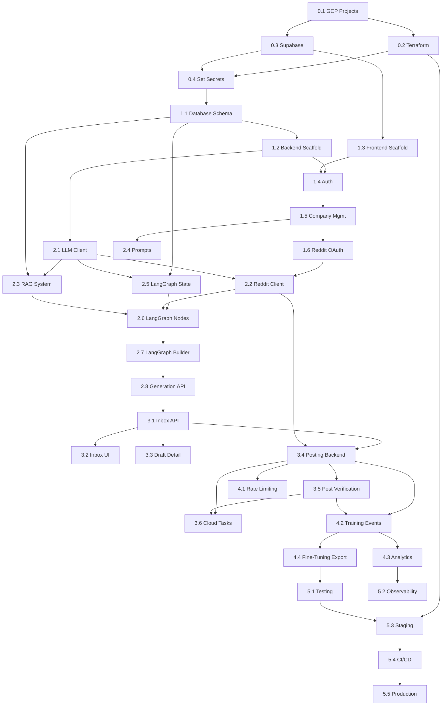

# Implementation Order - Dependency Graph

**Purpose**: This document defines the EXACT order to implement features, showing dependencies between components.

**For AI Agents**: Follow this sequence. Do not skip ahead. Each section must be complete before moving to the next.

---

## Overview: The Critical Path

```
Infrastructure → Database → Auth → Reddit OAuth → LangGraph → Review UI → Posting → Scale → Production
```

---

## Phase 0: Pre-Development (Before Writing Code)

### 0.1 Environment Setup
**Must Complete First**

```bash
# Create GCP projects
gcloud projects create mentions-dev
gcloud projects create mentions-staging  
gcloud projects create mentions-prod
```

**Dependencies**: None  
**Time**: 30 minutes  
**Verification**: Can run `gcloud projects list` and see all three projects

### 0.2 Terraform Infrastructure
**Depends On**: 0.1

```bash
cd mentions_terraform/environments/dev
terraform init
terraform plan
terraform apply
```

**Creates**:
- KMS keyring and keys
- Secret Manager secrets (placeholders)
- Service accounts
- Cloud Run services (placeholder)
- Cloud Tasks queues
- IAM permissions

**Dependencies**: GCP projects exist  
**Time**: 1 hour  
**Verification**: `terraform output` shows all resources  
**Reference**: [28-TERRAFORM-INFRASTRUCTURE.md](./28-TERRAFORM-INFRASTRUCTURE.md)

### 0.3 Supabase Projects
**Depends On**: None (can run in parallel with 0.2)

1. Create Supabase projects (dev, staging, prod)
2. Enable `pgvector` extension
3. Save credentials

**Dependencies**: None  
**Time**: 30 minutes  
**Verification**: Can connect with `psql`  
**Reference**: [02-ENVIRONMENT-SETUP.md](./02-ENVIRONMENT-SETUP.md)

### 0.4 Set Secrets
**Depends On**: 0.2, 0.3

```bash
# OpenAI API key
echo -n "sk-..." | gcloud secrets versions add openai-api-key --data-file=-

# Supabase keys
echo -n "eyJ..." | gcloud secrets versions add supabase-service-role-key --data-file=-

# Database connection
echo -n "postgresql://..." | gcloud secrets versions add db-connection-string --data-file=-
```

**Dependencies**: Terraform infrastructure, Supabase projects  
**Time**: 15 minutes  
**Verification**: `gcloud secrets versions list openai-api-key` shows version 1

---

## Phase 1: Foundation (Week 1-2)

**Milestone**: [M1-FOUNDATIONS.md](./M1-FOUNDATIONS.md)

### 1.1 Database Schema
**Depends On**: 0.3

**Create Tables** (in this order):
1. `companies` (no dependencies)
2. `auth.users` (Supabase built-in)
3. `user_company_link` (depends on: companies, auth.users)
4. `reddit_apps` (depends on: companies)
5. `reddit_accounts` (depends on: companies, auth.users)
6. `keywords` (depends on: companies)
7. `prompts` (depends on: companies)
8. `rag_documents` (depends on: companies)
9. `rag_chunks` (depends on: rag_documents)
10. `artifacts` (depends on: companies, reddit_accounts, keywords)
11. `drafts` (depends on: artifacts)
12. `posts` (depends on: drafts, reddit_accounts)
13. `training_events` (depends on: drafts, posts)
14. `fine_tuning_jobs` (depends on: companies)
15. `fine_tuning_exports` (depends on: companies)
16. `langgraph_checkpoints` (no dependencies)
17. `langgraph_checkpoint_writes` (depends on: langgraph_checkpoints)
18. `subscriptions` (depends on: companies)
19. `plan_limits` (no dependencies)
20. `invoices` (depends on: subscriptions)

**RLS Policies** (after all tables created):
- Enable RLS on all tables
- Create policies for each table

**Dependencies**: Supabase project with pgvector  
**Time**: 2 hours  
**Verification**: Can query all tables, RLS policies exist  
**Reference**: [03-DATABASE-SCHEMA.md](./03-DATABASE-SCHEMA.md)

### 1.2 Backend Scaffold
**Depends On**: 1.1

**Create Structure**:
```bash
cd mentions_backend
mkdir -p api core graph reddit rag llm models services tasks tests
```

**Implement Core**:
1. `core/config.py` - Environment variables with Pydantic
2. `core/database.py` - Supabase client
3. `core/logging.py` - Structured logging
4. `main.py` - FastAPI app with health check

**Files**:
```python
# core/config.py
from pydantic_settings import BaseSettings

class Settings(BaseSettings):
    ENV: str
    SUPABASE_URL: str
    SUPABASE_SERVICE_ROLE_KEY: str
    DB_CONN: str
    OPENAI_API_KEY: str
    GOOGLE_PROJECT_ID: str
    GOOGLE_LOCATION: str
    KMS_KEYRING: str
    KMS_KEY: str
    ALLOW_POSTS: bool = False
    LOG_LEVEL: str = "INFO"
    LOG_JSON: bool = True

settings = Settings()

# main.py
from fastapi import FastAPI
from core.logging import setup_logging

setup_logging()
app = FastAPI(title="Mentions API")

@app.get("/health")
def health_check():
    return {"status": "healthy", "env": settings.ENV}
```

**Dependencies**: Database schema complete  
**Time**: 2 hours  
**Verification**: `curl localhost:8000/health` returns 200  
**Reference**: [20-REPOSITORY-STRUCTURE.md](./20-REPOSITORY-STRUCTURE.md)

### 1.3 Frontend Scaffold
**Depends On**: None (can run in parallel with 1.2)

**Create Structure**:
```bash
cd mentions_frontend
npx create-next-app@14 . --typescript --tailwind --app
mkdir -p components/layout components/auth lib/supabase hooks types
```

**Implement Core**:
1. `lib/supabase/client.ts` - Supabase browser client
2. `lib/supabase/server.ts` - Supabase server client
3. `app/layout.tsx` - Root layout
4. `app/page.tsx` - Landing page

**Dependencies**: None  
**Time**: 1 hour  
**Verification**: `npm run dev` works, can see landing page  
**Reference**: [20-REPOSITORY-STRUCTURE.md](./20-REPOSITORY-STRUCTURE.md), [25-FRONTEND-PAGES.md](./25-FRONTEND-PAGES.md)

### 1.4 Authentication
**Depends On**: 1.1, 1.2, 1.3

**Backend** (`api/auth.py`):
```python
from fastapi import APIRouter, Depends
from core.auth import get_current_user

router = APIRouter()

@router.get("/me")
def get_me(user = Depends(get_current_user)):
    return user
```

**Frontend** (`components/auth/LoginForm.tsx`, `SignupForm.tsx`):
- Supabase Auth UI
- Login/signup forms
- Password reset

**Critical**: User-company linking on signup

**Dependencies**: Database schema, backend/frontend scaffolds  
**Time**: 4 hours  
**Verification**: Can sign up, log in, see user data  
**Reference**: [M1-FOUNDATIONS.md](./M1-FOUNDATIONS.md)

### 1.5 Company Management
**Depends On**: 1.4

**Backend** (`api/companies.py`):
- `POST /companies` - Create company
- `GET /companies/:id` - Get company
- `PUT /companies/:id` - Update company

**Frontend** (`app/settings/company/page.tsx`):
- Company settings form
- Goal, name, description

**Dependencies**: Auth complete  
**Time**: 3 hours  
**Verification**: Can create/update company, RLS enforced  
**Reference**: [M1-FOUNDATIONS.md](./M1-FOUNDATIONS.md)

### 1.6 Reddit App Setup
**Depends On**: 1.5

**Backend** (`reddit/encryption.py`, `api/reddit_accounts.py`):
1. KMS encrypt/decrypt functions
2. Reddit app CRUD (encrypted storage)
3. OAuth flow endpoints

**Frontend** (`app/settings/reddit-accounts/page.tsx`):
- Add Reddit app credentials (per company)
- OAuth flow button
- Connected accounts list

**Critical**: Test KMS encryption/decryption

**Dependencies**: Company management, GCP KMS  
**Time**: 6 hours  
**Verification**: Can store encrypted credentials, complete OAuth, get refresh token  
**Reference**: [M1-FOUNDATIONS.md](./M1-FOUNDATIONS.md), [22-HARD-RULES.md](./22-HARD-RULES.md) (Rule 4, 5)

---

## Phase 2: Generation Pipeline (Week 3-4)

**Milestone**: [M2-GENERATION-FLOW.md](./M2-GENERATION-FLOW.md)

### 2.1 LLM Client
**Depends On**: 1.2

**Backend** (`llm/client.py`):
```python
from openai import OpenAI

class LLMClient:
    def __init__(self):
        self.client = OpenAI(api_key=settings.OPENAI_API_KEY)
    
    def generate(self, prompt: str, temperature: float = 0.6):
        response = self.client.chat.completions.create(
            model="gpt-5-mini",
            messages=[{"role": "user", "content": prompt}],
            temperature=temperature
        )
        return response.choices[0].message.content
```

**Dependencies**: Backend scaffold  
**Time**: 1 hour  
**Verification**: Can call OpenAI API  
**Reference**: [17-GPT5-PROMPTING-GUIDE.md](./17-GPT5-PROMPTING-GUIDE.md)

### 2.2 Reddit Client
**Depends On**: 1.6, 2.1

**Backend** (`reddit/client.py`):
```python
import asyncpraw

class RedditClient:
    def __init__(self, client_id, client_secret, refresh_token):
        self.reddit = asyncpraw.Reddit(
            client_id=client_id,
            client_secret=client_secret,
            refresh_token=refresh_token,
            user_agent="Mentions/1.0"
        )
    
    async def search_subreddits(self, keyword: str):
        # Implementation
        pass
    
    async def get_threads(self, subreddit: str, limit: int):
        # Implementation
        pass
```

**Dependencies**: Reddit OAuth, LLM client  
**Time**: 3 hours  
**Verification**: Can search subreddits, fetch threads  
**Reference**: [18-REDDIT-API-REFERENCE.md](./18-REDDIT-API-REFERENCE.md)

### 2.3 RAG System
**Depends On**: 1.1, 2.1

**Implementation Order**:
1. `rag/embed.py` - OpenAI embeddings
2. `rag/store.py` - pgvector storage
3. `rag/ingest.py` - Document chunking and ingestion
4. `rag/retrieve.py` - Semantic search
5. `api/rag.py` - Upload endpoints

**Frontend** (`app/settings/rag/page.tsx`):
- File upload
- Document list
- Delete documents

**Dependencies**: Database schema, LLM client  
**Time**: 8 hours  
**Verification**: Can upload docs, retrieve relevant chunks  
**Reference**: [11-RAG-IMPLEMENTATION.md](./11-RAG-IMPLEMENTATION.md)

### 2.4 Prompt Management
**Depends On**: 1.5

**Backend** (`api/prompts.py`):
- CRUD for prompts
- Template rendering with Jinja2

**Frontend** (`app/settings/prompts/page.tsx`):
- Prompt editor
- Variable documentation
- Default prompts

**Dependencies**: Company management  
**Time**: 4 hours  
**Verification**: Can create/edit prompts with variables  
**Reference**: [M2-GENERATION-FLOW.md](./M2-GENERATION-FLOW.md)

### 2.5 LangGraph State & Checkpointer
**Depends On**: 1.1, 2.1

**Backend** (`graph/state.py`, `graph/checkpointer.py`):
```python
from typing import TypedDict
from langgraph.checkpoint.postgres import PostgresSaver

class GenerateState(TypedDict):
    company_id: str
    user_id: str
    keyword: str
    subreddit: str
    thread_id: str
    draft: str
    error: str
    # ... more fields

def get_checkpointer():
    return PostgresSaver.from_conn_string(settings.DB_CONN)
```

**Dependencies**: Database schema (langgraph_checkpoints), LLM client  
**Time**: 2 hours  
**Verification**: State persists across restarts  
**Reference**: [M2-GENERATION-FLOW.md](./M2-GENERATION-FLOW.md)

### 2.6 LangGraph Nodes (In Order)
**Depends On**: 2.5, 2.2, 2.3

**Implementation Order** (each node depends on previous):
1. `graph/nodes/fetch_subreddits.py` - Search Reddit
2. `graph/nodes/judge_subreddit.py` - LLM judge (HARD GATE)
3. `graph/nodes/fetch_rules.py` - Get subreddit rules
4. `graph/nodes/fetch_threads.py` - Get hot threads
5. `graph/nodes/rank_threads.py` - LLM ranking
6. `graph/nodes/rag_retrieve.py` - Get relevant docs
7. `graph/nodes/draft_compose.py` - Generate draft
8. `graph/nodes/vary_draft.py` - Create variations
9. `graph/nodes/judge_draft.py` - LLM quality gate (HARD GATE)
10. `graph/nodes/emit_ready.py` - Save to database

**Critical**: Judge nodes MUST enforce hard stops (see Rule 3)

**Dependencies**: LangGraph state, Reddit client, RAG system  
**Time**: 16 hours (2 hours per node)  
**Verification**: Each node runs successfully, judges enforce gates  
**Reference**: [10-LANGGRAPH-FLOW.md](./10-LANGGRAPH-FLOW.md), [22-HARD-RULES.md](./22-HARD-RULES.md) (Rule 3)

### 2.7 LangGraph Builder
**Depends On**: 2.6

**Backend** (`graph/build.py`):
```python
from langgraph.graph import StateGraph, END

def build_generate_graph(checkpointer):
    graph = StateGraph(GenerateState)
    
    # Add all nodes
    graph.add_node("fetch_subreddits", fetch_subreddits)
    # ... add remaining nodes
    
    # Define flow with conditional edges
    graph.add_conditional_edges(
        "judge_subreddit",
        lambda state: "end" if state.get("error") else "continue",
        {"continue": "fetch_rules", "end": END}
    )
    
    return graph.compile(checkpointer=checkpointer)
```

**Dependencies**: All LangGraph nodes  
**Time**: 3 hours  
**Verification**: Graph compiles, can execute end-to-end  
**Reference**: [10-LANGGRAPH-FLOW.md](./10-LANGGRAPH-FLOW.md)

### 2.8 Generation API Endpoint
**Depends On**: 2.7

**Backend** (`api/generate.py`):
```python
@router.post("/generate")
async def generate_artifacts(request: GenerateRequest, user = Depends(get_current_user)):
    thread_id = f"{user.company_id}:{request.keyword}:{uuid4().hex[:8]}"
    
    initial_state = {
        "company_id": user.company_id,
        "keyword": request.keyword,
        # ... more fields
    }
    
    graph = build_generate_graph(get_checkpointer())
    result = await graph.ainvoke(initial_state, config={"thread_id": thread_id})
    
    return {"success": not result.get("error"), "artifact_id": result.get("artifact_id")}
```

**Dependencies**: LangGraph builder  
**Time**: 2 hours  
**Verification**: API call triggers generation pipeline  
**Reference**: [M2-GENERATION-FLOW.md](./M2-GENERATION-FLOW.md)

---

## Phase 3: Review UI & Posting (Week 5-6)

**Milestone**: [M3-REVIEW-UI.md](./M3-REVIEW-UI.md)

### 3.1 Inbox API
**Depends On**: 2.8

**Backend** (`api/drafts.py`):
- `GET /drafts` - List drafts with filters/pagination
- `GET /drafts/:id` - Get single draft with context
- `PUT /drafts/:id` - Update draft text
- `POST /drafts/:id/approve` - Approve draft
- `POST /drafts/:id/reject` - Reject draft

**Dependencies**: Generation pipeline complete  
**Time**: 4 hours  
**Verification**: Can list, filter, and update drafts  
**Reference**: [21-API-ENDPOINTS.md](./21-API-ENDPOINTS.md)

### 3.2 Inbox UI
**Depends On**: 3.1

**Frontend** (`app/inbox/page.tsx`):
- Draft list (table on desktop, cards on mobile)
- Filters (risk, keyword, subreddit, status)
- Sorting
- Pagination

**Dependencies**: Inbox API  
**Time**: 6 hours  
**Verification**: Can see drafts, filter, sort  
**Reference**: [14-UI-SPECIFICATIONS.md](./14-UI-SPECIFICATIONS.md), [27-RESPONSIVE-SEO.md](./27-RESPONSIVE-SEO.md)

### 3.3 Draft Detail View
**Depends On**: 3.1

**Frontend** (`app/drafts/[id]/page.tsx`):
- Thread context (original post, top comments)
- Draft editor with preview
- Approval/rejection buttons
- Risk assessment display

**Dependencies**: Inbox API  
**Time**: 6 hours  
**Verification**: Can view and edit drafts, see context  
**Reference**: [14-UI-SPECIFICATIONS.md](./14-UI-SPECIFICATIONS.md)

### 3.4 Posting Backend
**Depends On**: 3.1, 2.2

**Backend** (`services/post.py`, `api/posts.py`):
```python
async def post_to_reddit(draft_id: str, approved_by: str):
    # Rule 1: Check approval
    draft = await get_draft(draft_id)
    if draft.status != "approved" or not draft.approved_by:
        raise Exception("Draft not approved")
    
    # Rule 10: Check environment
    if settings.ENV != "prod" or not settings.ALLOW_POSTS:
        return mock_post(draft)
    
    # Rule 6: Check rate limits
    is_eligible, reason = await check_post_eligibility(
        draft.company_id, draft.reddit_account_id, draft.subreddit
    )
    if not is_eligible:
        raise Exception(reason)
    
    # Post to Reddit
    reddit_client = await get_reddit_client(draft.company_id, draft.reddit_account_id)
    result = await reddit_client.post(draft.body, draft.thread_id)
    
    # Save post record
    post = await create_post(draft_id, result)
    
    # Rule 8: Schedule verification
    await schedule_verification(post.id, delay=60)
    
    return post
```

**Critical**: Implement ALL hard rules (1, 2, 6, 8, 10)

**Dependencies**: Inbox API, Reddit client  
**Time**: 8 hours  
**Verification**: Can post (in dev: mocked, in prod: real), all rules enforced  
**Reference**: [12-POSTING-FLOW.md](./12-POSTING-FLOW.md), [22-HARD-RULES.md](./22-HARD-RULES.md)

### 3.5 Post Verification
**Depends On**: 3.4

**Backend** (`tasks/verify_post.py`):
```python
async def verify_post_visibility(post_id: str):
    post = await get_post(post_id)
    
    # Wait for Reddit to process
    await asyncio.sleep(30)
    
    # Fetch as unauthenticated user
    is_visible = await check_post_visible(post.reddit_post_id)
    
    if is_visible:
        await mark_post_verified(post_id)
    else:
        await mark_post_removed(post_id)
        await notify_user(post_id, "Post appears to be removed")
```

**Dependencies**: Posting backend  
**Time**: 3 hours  
**Verification**: Posts are verified after 60 seconds  
**Reference**: [12-POSTING-FLOW.md](./12-POSTING-FLOW.md), [22-HARD-RULES.md](./22-HARD-RULES.md) (Rule 8)

### 3.6 Cloud Tasks Integration
**Depends On**: 3.4, 3.5

**Backend** (`tasks/generate.py`, `tasks/verify_post.py`):
- Queue-based task execution
- Retry logic
- Rate limiting via queue configuration

**Dependencies**: Posting backend, verification  
**Time**: 4 hours  
**Verification**: Tasks execute asynchronously, rate limits enforced  
**Reference**: [28-TERRAFORM-INFRASTRUCTURE.md](./28-TERRAFORM-INFRASTRUCTURE.md), [13-RATE-LIMITING.md](./13-RATE-LIMITING.md)

---

## Phase 4: Scale & Learning (Week 7-8)

**Milestone**: [M4-VOLUME-LEARNING.md](./M4-VOLUME-LEARNING.md)

### 4.1 Rate Limiting Service
**Depends On**: 3.4

**Backend** (`services/rate_limiter.py`):
```python
async def check_post_eligibility(company_id, account_id, subreddit):
    # Check all rate limit rules
    # Return (is_eligible, reason)
    pass
```

**Dependencies**: Posting backend  
**Time**: 4 hours  
**Verification**: Rate limits enforced, returns correct eligibility  
**Reference**: [13-RATE-LIMITING.md](./13-RATE-LIMITING.md), [22-HARD-RULES.md](./22-HARD-RULES.md) (Rule 6)

### 4.2 Training Events
**Depends On**: 3.4, 3.5

**Backend** (add to posting flow):
```python
async def log_training_event(draft_id: str, post_id: str, event_type: str):
    await db.execute(
        """
        INSERT INTO training_events (draft_id, post_id, event_type, data)
        VALUES ($1, $2, $3, $4)
        """,
        draft_id, post_id, event_type, {...}
    )
```

**Log Events**:
- Draft approved
- Draft rejected
- Draft edited
- Post succeeded
- Post removed

**Dependencies**: Posting backend, verification  
**Time**: 3 hours  
**Verification**: Events logged for all actions  
**Reference**: [16-RL-FINE-TUNING.md](./16-RL-FINE-TUNING.md)

### 4.3 Analytics API
**Depends On**: 4.2

**Backend** (`api/analytics.py`):
- Post volume by day/week
- Success rate
- Top subreddits
- Average approval time

**Frontend** (`app/analytics/page.tsx`):
- Charts and graphs
- Key metrics

**Dependencies**: Training events  
**Time**: 6 hours  
**Verification**: Can see analytics dashboard  
**Reference**: [23-OBSERVABILITY.md](./23-OBSERVABILITY.md)

### 4.4 Fine-Tuning Export
**Depends On**: 4.2

**Backend** (`services/fine_tuning.py`):
```python
async def export_training_data(company_id: str, start_date, end_date):
    # Fetch training events
    # Format as OpenAI fine-tuning JSONL
    # Upload to GCS
    # Return export record
    pass
```

**Dependencies**: Training events  
**Time**: 5 hours  
**Verification**: Can export training data in correct format  
**Reference**: [19-COMPANY-FINE-TUNING.md](./19-COMPANY-FINE-TUNING.md)

---

## Phase 5: Production Ready (Week 9-10)

**Milestone**: [M5-PRODUCTION.md](./M5-PRODUCTION.md)

### 5.1 Comprehensive Testing
**Depends On**: All previous phases

**Create Tests**:
1. Unit tests for all services
2. Integration tests for API endpoints
3. E2E tests for critical flows

**Priority Tests**:
- Hard rules enforcement (all 10 rules)
- Rate limiting
- Company isolation
- Draft approval flow
- Posting flow

**Dependencies**: All features complete  
**Time**: 16 hours  
**Verification**: Test coverage >80%, all hard rules tested  
**Reference**: [15-TESTING-PLAN.md](./15-TESTING-PLAN.md)

### 5.2 Observability
**Depends On**: All previous phases

**Implement**:
1. Structured logging (already in place)
2. Metrics collection
3. Error tracking
4. Alerts

**Dependencies**: All features  
**Time**: 6 hours  
**Verification**: Can trace requests, see metrics, receive alerts  
**Reference**: [23-OBSERVABILITY.md](./23-OBSERVABILITY.md), [24-LOGGING-DEBUGGING.md](./24-LOGGING-DEBUGGING.md)

### 5.3 Staging Environment
**Depends On**: 0.2, 5.1

**Setup**:
1. Apply Terraform for staging
2. Deploy backend/frontend to staging
3. Run smoke tests

**Critical**: ALLOW_POSTS=false in staging

**Dependencies**: Terraform, tests  
**Time**: 4 hours  
**Verification**: Staging works, posting disabled  
**Reference**: [28-TERRAFORM-INFRASTRUCTURE.md](./28-TERRAFORM-INFRASTRUCTURE.md)

### 5.4 CI/CD Pipeline
**Depends On**: 5.1, 5.3

**Implement** (`.github/workflows/`):
1. `test.yml` - Run tests on PR
2. `deploy-backend.yml` - Deploy backend to Cloud Run
3. `deploy-frontend.yml` - Deploy frontend to Vercel
4. `terraform-plan.yml` - Terraform plan on PR
5. `terraform-apply.yml` - Apply on merge to main

**Dependencies**: Tests, staging environment  
**Time**: 6 hours  
**Verification**: CI/CD runs on every PR/merge  
**Reference**: [28-TERRAFORM-INFRASTRUCTURE.md](./28-TERRAFORM-INFRASTRUCTURE.md)

### 5.5 Production Deployment
**Depends On**: 5.3, 5.4

**Deploy**:
1. Apply Terraform for production
2. Set ALLOW_POSTS=true in production ONLY
3. Deploy backend/frontend
4. Run smoke tests in production
5. Monitor for issues

**Dependencies**: Everything  
**Time**: 4 hours  
**Verification**: Production works, posting enabled, monitoring active  
**Reference**: [M5-PRODUCTION.md](./M5-PRODUCTION.md)

---

## Dependency Visualization



---

## Critical Path Items

These MUST be done correctly or everything breaks:

1. **Database Schema** (1.1) - All tables depend on this
2. **Auth** (1.4) - Required for all API calls
3. **Reddit OAuth** (1.6) - Required for Reddit API access
4. **LangGraph State** (2.5) - Required for generation pipeline
5. **Posting Backend** (3.4) - Must enforce ALL hard rules
6. **Testing** (5.1) - Must verify all hard rules

---

## Time Estimates Summary

| Phase | Component | Time |
|-------|-----------|------|
| 0 | Pre-Development | 2.5 hours |
| 1 | Foundation | 40 hours (1 week) |
| 2 | Generation Pipeline | 80 hours (2 weeks) |
| 3 | Review UI & Posting | 80 hours (2 weeks) |
| 4 | Scale & Learning | 40 hours (1 week) |
| 5 | Production Ready | 80 hours (2 weeks) |
| **Total** | | **322.5 hours (~8-10 weeks)** |

---

## Verification Checklist

After each phase, verify:

**Phase 1**:
- [ ] Can sign up and log in
- [ ] Company data isolated (RLS works)
- [ ] Reddit OAuth completes successfully
- [ ] Credentials encrypted with KMS

**Phase 2**:
- [ ] Generation pipeline runs end-to-end
- [ ] LLM judges enforce hard stops
- [ ] RAG retrieves relevant docs
- [ ] State persists in database

**Phase 3**:
- [ ] Drafts appear in inbox
- [ ] Can edit and approve drafts
- [ ] Posting enforces approval requirement
- [ ] Posts are verified

**Phase 4**:
- [ ] Rate limits enforced
- [ ] Training events logged
- [ ] Analytics dashboard shows data
- [ ] Can export training data

**Phase 5**:
- [ ] All hard rules tested
- [ ] Staging environment works
- [ ] CI/CD deploys automatically
- [ ] Production ready

---

## For AI Agents: How to Use This Document

1. **Start at Phase 0** - Do not skip infrastructure setup
2. **Complete each section in order** - Dependencies are strict
3. **Verify after each component** - Don't move on until it works
4. **Reference hard rules frequently** - Especially when implementing posting
5. **Ask for clarification** if a dependency is unclear

**Example Execution**:
```
1. Check: Is Terraform infrastructure complete? (Phase 0.2)
   NO → Go to 28-TERRAFORM-INFRASTRUCTURE.md and complete
   YES → Continue

2. Check: Is database schema created? (Phase 1.1)
   NO → Go to 03-DATABASE-SCHEMA.md and create all tables
   YES → Continue

3. Check: Is backend scaffold created? (Phase 1.2)
   NO → Create structure from 20-REPOSITORY-STRUCTURE.md
   YES → Continue

... and so on
```

This is your roadmap. Follow it sequentially for success.


